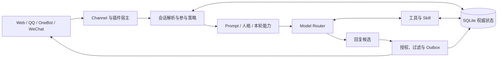

<p align="center">
  
</p>

<h1 align="center">iJA for u</h1>

<p align="center">
  <strong>让 AI 不只回答问题，也能在关系与语境中自然地出现。</strong>
  <br />
  面向私聊与群聊的本地优先、自托管拟人聊天 Agent。
</p>

<p align="center">
  <a href="https://github.com/iJA774/iJA-for-u/actions/workflows/ci.yml"></a>
  
  
  
  
</p>

<p align="center">
  <a href="#-快速开始">快速开始</a> ·
  <a href="#-核心能力">核心能力</a> ·
  <a href="#-系统如何工作">系统设计</a> ·
  <a href="#-平台与扩展">平台与扩展</a> ·
  <a href="#-安全与数据">安全与数据</a>
</p>

> [!IMPORTANT]
> iJA for u 当前处于预览阶段，配置结构、插件协议和数据 schema 仍可能变化。它默认仅监听本机回环地址，不是面向公网、多租户或无人值守运营的 SaaS 服务。

## 为什么是 iJA

许多聊天机器人擅长“立刻给出一个正确答案”，却不擅长判断什么时候该说、该记住什么，以及一次回复是否真的送达。iJA for u 把这些问题放在模型之外，由应用层拥有状态、权限和副作用：模型负责理解与表达，系统负责边界与可信结果。

它更像一个长期相处的聊天伙伴：能在私聊里延续关系，在群聊里阅读气氛；会形成可查看、可纠正、可撤回的记忆，也会在满足规则时通过定时任务、公开 Feed 或低打扰候选主动出现。

## ✨ 核心能力

| | 能力 | 说明 |
|---|---|---|
| 💬 | **私聊与群聊策略** | 按会话类型装配上下文；群聊支持 @、引用、频率控制、回复必要性与合法沉默。 |
| 🎭 | **可切换人格** | 人格身份、表达 Prompt 与私聊/群聊分配分别管理；支持在控制台编辑和版本冲突保护。 |
| 🧠 | **可治理的长期记忆** | 画像、偏好、事件、互动情节、关系与步骤分域存储；支持召回测试、纠正、撤回和来源追踪。 |
| 🌱 | **社交学习** | 独立学习黑话、群体表达与行为经验，带证据、置信度、时效衰减和会话隔离。 |
| ⏰ | **主动触达与 Drift** | 定时任务、RSS/Atom 候选和低打扰话题均需重新经过静默时段、间隔、抢占和送达门控。 |
| 🧰 | **工具、Skill 与插件** | 原生工具循环、声明式 Skill、平台插件和受管服务；能力按本轮真实授权投影给模型。 |
| 🖼️ | **视觉与表情** | 可选视觉模型理解图片；从本地图库复用表情，必要时才调用独立图片模型生成。 |
| 🛡️ | **本地控制与可恢复状态** | SQLite + Alembic、工作区锁、readiness、事件游标、出站状态机与备份/恢复演练。 |

## 🚀 快速开始

### 环境要求

- Python `3.12` 或 `3.13`
- [uv](https://docs.astral.sh/uv/) `0.11.30` 或兼容版本
- Node.js `20+` 与 npm（用于构建 Web 控制台）
- Windows 是当前优先支持平台；Linux 可用于开发与测试，但本机凭据保护能力有所不同

### 1. 获取代码并安装依赖

```bash
git clone https://github.com/iJA774/iJA-for-u.git
cd iJA-for-u

uv sync --frozen --extra dev
npm --prefix frontend ci
npm --prefix frontend run build
```

### 2. 启动

```bash
uv run ija
```

服务默认监听 `http://127.0.0.1:8000`。首次启动会创建本地数据库、执行迁移并生成高熵控制 Token；默认 `fake` 模型不会访问外部服务，也不会产生模型费用。

在另一个终端生成一次性本机登录链接：

```bash
uv run ija-maintenance control-login-url
```

在同一台设备的浏览器中打开命令输出的 URL。Token 只存在于 URL fragment，前端会在首个网络请求前清除它并换取 HttpOnly 会话 Cookie。不要分享、截图或保存该链接。

### 3. 接入真实模型

最简单的方式是在 Web 控制台的“模型设置”中选择 OpenAI-compatible 协议，填写 Base URL、模型名与 API Key，并执行能力探测。聊天模型支持：

- OpenAI Chat Completions
- OpenAI Responses
- Anthropic Messages 兼容端点

也可以仅在当前终端注入环境变量：

```powershell
$env:IJA_MODEL_MODE = "openai"
$env:IJA_MODEL_BASE_URL = "https://api.openai.com/v1"
$env:IJA_MODEL_API_KEY = "<your-api-key>"
$env:IJA_MODEL_NAME = "<your-model>"
uv run ija
```

完整变量模板位于 [`.env.example`](.env.example)。示例文件不包含任何真实凭据；请勿将本机 `.env`、`config/*.local.toml` 或 `data/` 提交到版本库。

## 🧭 系统如何工作



系统围绕三条原则设计：

1. **状态有唯一 owner**：会话、记忆、权限、任务和出站结果由应用层维护，Prompt 只是一次调用的临时视图。
2. **发送成功才算发生**：生成成功不等于送达成功；只有 Channel 确认送达后，消息才进入历史并触发后续归档。
3. **外部内容始终不可信**：消息、Feed、工具结果、图片描述和记忆正文都以数据边界注入，不能覆盖系统规则或扩大权限。

## 🔌 平台与扩展

所有外部平台默认关闭，需要在本机配置中显式启用。

| 扩展 | 用途 | 关键边界 |
|---|---|---|
| [OneBot 11](plugins/onebot/README.md) | 正向 WebSocket；私聊/群聊文本、@、引用与图片 | 依赖外部 OneBot 实现，请自行评估账号和平台合规风险 |
| [QQ 开放平台](plugins/qq/README.md) | 官方机器人单聊与群聊文本 | 不登录普通 QQ 账号 |
| [微信服务号](plugins/wechat/README.md) | 消息回调与客服消息 | 只允许精确公开回调路径，控制台 `/api` 不得暴露公网 |
| [Delayed Reply](plugins/delayed_reply/README.md) | 合并短时间内连续私聊消息与 typing 事件 | 只影响入站节奏，不拥有最终发送权限 |
| Filter | 统一出站词表过滤，可选独立检测模型 | 检测模型凭据与聊天模型隔离 |
| Skill Foundry | 把验证过的工作整理为可审查 Skill | 安装需要管理员身份、独立确认与摘要复核 |

内置 Skill 覆盖本地黑名单、群管理、表情发送和按负责人汇总行动项。插件通过 `plugin.toml` 声明贡献与权限；Skill 通过 `SKILL.md`、`runtime.toml` 和宿主能力协议保持可移植边界。

## ⚙️ 配置

| 位置 | 作用 | 是否应提交 |
|---|---|---|
| `config/default.toml` | 非敏感默认值与功能开关 | 是 |
| `config/personas/*.toml` | 随项目分发的人格元数据 | 是 |
| `config/local.toml` / `config/*.local.toml` | 本机覆盖与凭据引用 | 否 |
| `.env.example` | 环境变量名称和空值示例 | 是 |
| `data/` | SQLite、附件、凭据密文和运行状态 | 否 |

Embedding、视觉和图片模型都是独立开关与独立凭据。Embedding 未配置时，记忆仍可使用本地 BM25/结构化召回；图片模型默认关闭，避免无意产生费用。

## 🔐 安全与数据

- 控制面默认只绑定 `127.0.0.1`，并使用高熵 Token、HttpOnly Cookie、精确 Host/Origin 列表和会话限流。
- Windows 上模型凭据默认用当前用户 DPAPI 密封到 `data/secrets/`；其他平台应从环境注入，或配置独立主密钥。
- 平台回调、文件上传、Feed、插件清单和模型结构化输出都在信任边界集中校验。
- 记忆、向量索引和社交学习按 Session 精确隔离；派生索引不会反向覆盖权威事实。
- 这是单用户本地控制面。若使用反向代理，只公开平台所需的精确回调路径，绝不要把 `/api` 或整个站点直接暴露到公网。
- AI 输出可能错误；涉及账号操作、群管理、隐私、医疗、法律或财务决策时必须由人复核。

安全问题请使用 GitHub 的 [Private vulnerability reporting](https://github.com/iJA774/iJA-for-u/security/advisories/new)，不要在公开 Issue 中提交 Token、聊天原文、数据库或用户隐私。

## 🧪 开发与验证

```bash
# Python
uv run ruff check src tests plugins
uv run pyright
uv run pytest

# Web 控制台
npm --prefix frontend run lint
npm --prefix frontend run test
npm --prefix frontend run build

# 端到端测试（首次需安装 Chromium）
npx --prefix frontend playwright install chromium
npm --prefix frontend run e2e
```

测试使用隔离数据库与临时目录，不读取日常 `data/`。GitHub Actions 会在 Windows 与 Linux 上验证 Python，在 Node 20 上执行前端检查，并在 Windows 上运行 Playwright 端到端测试。

维护命令支持备份、严格校验与真实恢复演练：

```powershell
uv run ija-maintenance backup D:\ija-backups\snapshot
uv run ija-maintenance verify D:\ija-backups\snapshot
uv run ija-maintenance restore-smoke D:\ija-backups\snapshot
```

覆盖恢复必须显式追加 `--confirm RESTORE`。

## 🗺️ 当前边界

- 以源码仓库方式运行；当前 wheel 不包含完整的配置、Prompt、Skill、迁移与前端静态资源。
- 主要面向单机、单操作者，不提供多租户 RBAC 或公网管理面。
- 平台插件依赖各平台政策与第三方实现；启用前请自行确认服务条款、账号风险和当地法规。
- 协议兼容不代表所有供应商实现一致；上线前应在控制台完成文本、JSON、工具、视觉和流式能力探测。

## 🤝 参与贡献

欢迎通过 [Issues](https://github.com/iJA774/iJA-for-u/issues) 报告可复现问题或讨论设计。提交 Pull Request 前，请确保：

1. 行为变化有对应测试，失败路径与权限边界也被覆盖；
2. 不包含真实凭据、聊天正文、生产数据库、内部审计材料或第三方原始 Prompt；
3. Python 与前端检查全部通过，且变更保持简体中文优先；
4. 新的外部副作用有唯一 owner、明确授权和可追踪结果。

## 📄 许可

当前仓库尚未附带开源许可证。源码公开可见不等于授权复制、修改或再分发；除非版权所有者另行书面授权，保留全部权利。正式采用许可证后，本节与仓库根目录的 `LICENSE` 将同步更新。

---

<p align="center">
  <sub>iJA for u · Built for conversations that have memory, timing and boundaries.</sub>
</p>
