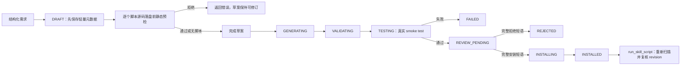

# Skill 工坊

`skill_foundry` 是 iJA 的项目内插件，用于把已经完成并验证过的工作沉淀为可审查、可安装的 Skill。它借鉴 GenericAgent 的“工具结果驱动下一轮、周期性保存检查点、失败时显式换策略”思路，但使用 iJA 自己的任务状态、权限、托管服务和持久化边界，不复用参考项目的主循环或全局状态。

当前版本为 `0.2.0`，支持说明型 Skill、Markdown 参考资料，以及受限的可复用 Python 脚本。

## 组件

| 文件 | 职责 |
| --- | --- |
| `plugin.toml` | 声明 Skill 根、`workspace:skills:write` 权限与 Builder 托管服务 |
| `controller.py` | 任务状态、owner 校验、静态/动态验证、冻结 revision、审批、安装与已安装脚本执行 |
| `worker.py` | 在最小环境的短生命周期进程中写入草案；不执行生成脚本 |
| `sandbox_runner.py` | AST 安全检测、restricted builtins、audit policy、资源限制与 `main(data)` 执行 |
| `skills/skill-creator/` | 模型可加载的工作流、工具参数模型和安全说明 |

正式 Skill 只由 `controller.py` 安装。Worker 和 Sandbox 都不能直接写入 `skills/`。

## 生命周期



`generate`、`validate`、`test` 三个 checkpoint 都必须带真实证据。任何缺失、超时、策略拒绝或摘要不一致都会失败，不会用默认值制造“已完成”。

## 生成内容

基础包包含：

- `SKILL.md`
- `agents/openai.yaml`
- 可选 `references/*.md`
- 可选 `scripts/*.py`

脚本必须定义：

```python
def main(data):
    values = data["values"]
    return {"count": len(values), "total": sum(values)}
```

输入和返回值都必须是有限 JSON。脚本不能使用文件、网络、环境变量、子进程、原生库、动态导入或反射。完整 allowlist、资源限制与威胁边界见 [`skills/skill-creator/references/security-boundary.md`](skills/skill-creator/references/security-boundary.md)。

## 工具

初始只暴露宿主的 `load_skill`；模型加载 `skill-creator` 后，宿主才动态暴露下列工具，并在执行入口再次检查加载状态：

- `create_skill_draft`：一次调用创建不含脚本的说明型 Skill。
- `begin_skill_draft`：为带脚本 Skill 创建轻量草案，不携带源码。
- `add_skill_script`：向草案添加一个受限脚本；最后一个脚本可直接触发构建。
- `finalize_skill_draft`：完成没有脚本或已分步添加脚本的草案。
- `get_skill_build`：查询状态、checkpoint、revision 与确认短语。
- `preview_skill_draft_file`：分块读取冻结的 Skill、reference 或脚本源码。
- `run_skill_script`：运行由工坊安装且未漂移的脚本。
- `install_skill_draft`：在用户新消息完全匹配确认短语时原子安装。
- `reject_skill_draft`：在用户新消息完全匹配拒绝短语时终止任务。

创建草案和安装必须分属两条用户消息。同名 Skill 不覆盖。

## 沙箱策略

安全控制分为六层：

1. 输入大小、路径、名称、JSON 和明显敏感字段校验；
2. 落盘前 AST、凭据、敏感路径和导入 allowlist 扫描；
3. 只提供少量 builtins 与预载纯计算模块；
4. Python audit hook 拒绝文件、网络、注册表、`ctypes`、进程和链接操作；
5. 独立进程、最小环境、4 秒 wall timeout，并在平台支持时增加 CPU/内存/进程 OS 上限；
6. 安装前后复核完整 manifest、源码 SHA-256、策略版本和 smoke test 证据。

这是受限 Python 子集，不是容器或虚拟机。它不承诺防御解释器或操作系统的未知漏洞，因此不支持 shell、原生扩展、任意 runtime、文件处理或联网脚本。

## 数据与审计

权威任务保存在：

```text
data/skill-workbench/<job-id>/
├── job.json
├── draft/
├── installing/        # 仅 INSTALLING 事务可能存在
└── executions/
    └── <execution-id>.json
```

任务绑定创建者的 `actor_id` 与 `session_id`。成功脚本执行的审计记录不保存输入、输出正文，只保存调用身份、源码摘要、输入/输出摘要、策略版本和时间。

请勿把真实聊天原文、生产数据、凭据或隐私正文放进 objective、reference、源码或 smoke input。

## 本地验证

从项目根目录运行：

```powershell
.\.venv\Scripts\python.exe -m pytest tests/unit/test_skill_foundry_plugin.py tests/unit/test_personas.py
.\.venv\Scripts\python.exe -m ruff check plugins/skill_foundry tests/unit/test_skill_foundry_plugin.py tests/unit/test_personas.py
.\.venv\Scripts\python.exe -m pyright
```

直接验证沙箱真实进程链路：

```powershell
$request = @{
  action = "execute"
  script_name = "scripts/summarize.py"
  source = "def main(data):`n    return {'total': sum(data['values'])}`n"
  input = @{ values = @(1, 2, 3) }
} | ConvertTo-Json -Depth 10 -Compress

$request | .\.venv\Scripts\python.exe -I plugins\skill_foundry\sandbox_runner.py
```

托管服务的启动、建包、状态损坏恢复和真实 JSON Lines 调用由 `test_managed_service_protocol_runs_real_controller` 覆盖。

## 专用人格

`prompts/persona/skill_foundry.md` 提供“Skill 工匠”人格，只包含 Skill 工作职责和安全验收要求，不附加年龄、背景、情绪或口癖。它会优先使用本插件；其他人格仍可在用户明确要求沉淀 Skill 时加载 `skill-creator`。
